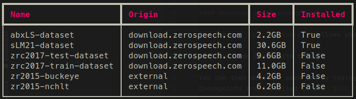
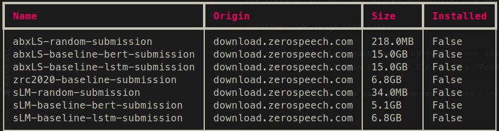
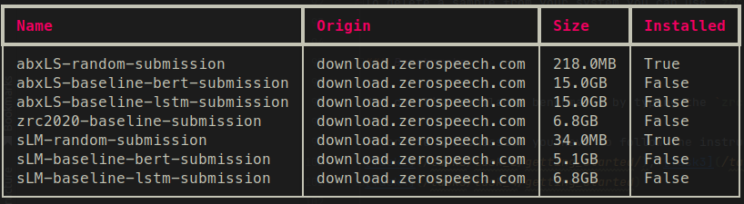

# Zero Resource Challenge Benchmark Toolkit  

   

This repository contains a toolbox assisting in running and handling all things related to the zerospeech benchmarks.
For more information on the [Zero Resource Challenge you can visit our website](https://zerospeech.com).

This toolbox allows to download all resources linked with the benchmarks (datasets, model checkpoints, samples, etc..),
to run the various benchmarks on your own submissions, and to upload the results to our website for them to be included in our leaderboards.

The available resources can be also found directly on our repository [download.zerospeech.com](https://download.zerospeech.com) 


## Installation

The zerospeech benchmark toolbox is a python package, so you require a version of python installed on your system
before you can start. 

You can use [miniconda](https://docs.conda.io/en/latest/miniconda.html) a 
lightweight version of anaconda or any other way of installing python you prefer. 

**Note that the package has been tested on python 3.8+, other versions are not recommended.** 

Once python is installed you can install the package using :

```
pip install "zerospeech-benchmarks[all]"
```

If you are a conda user you can use our conda environment :

```
conda env create coml/zerospeech-benchmark
```


To verify that the toolbox is installed correctly you can try `zrc version` which should print 
the version information. If this is not the case you can open an issue with your errors on directly on our 
[github](https://github.com/zerospeech/benchmarks/issues)


## Toolbox Usage 

### Downloads


Installation location can be specified using the environment variable `APP_DIR`, in linux & macOS this can 
be done in a terminal:

`$ export APP_DIR=/location/to/data`

By default, all data is saved in `$HOME/zr-data`

All temporary files are saved in `/tmp` this can be changed using the environment variable `TMP_DIR`


#### Download benchmark datasets


You can start by listing the available datasets using the command `zrc datasets` then you can download the 
dataset you want using the command `zrc datasets:pull [dataset-name]`.

> When listing datasets the **Installed** column specifies whether the dataset has been downloaded.



Datasets are installed in the `$APP_DIR/datasets` folder.
To delete a dataset you can use the command `zrc dataset:rm [dataset-name]`


#### Download model checkpoints

The command `zrc checkpoints` allows you to list available checkpoints.

You can then download each set by typing `zrc checkpoints:pull [name]`
Checkpoints are installed in the `$APP_DIR/checkpoints` folder.



To delete the checkpoints you can use the command : `zrc checkpoints:rm [name]`


#### Download samples

The command `zrc samples` allows you to list the available samples.

You can then download each sample by typing `zrc samples:pull [name]`.
Samples are installed in the `$APP_DIR/samples` folder.



To delete a sample from your system you can use `zrc samples:rm [name]`


### Benchmarks

You can list available benchmarks by typing the `zrc benchmarks` command.

To create a submission you have to follow the instructions on each of our task pages [Task1](/tasks/task_1/getting_started/), 
[Task2](/tasks/task_2/getting_started/), [Task3](/tasks/task_3/getting_started/),
[Task4](/tasks/task_4/getting_started)


**Some older benchmarks may not be available straight away, but they will be added as soon as possible.**

Once the submission has been created you can run the benchmark on it 
with the following command : 

- `zrc benchmarks:run [name] [/path/to/submission] [...args]` 

Some benchmarks are split into sub-tasks you can run partial tasks by using the following syntax:

- `zrc benchmarks:run sLM21 [/path/to/submission]  -t lexical syntactic`

With this syntax we run the sLM21 benchmark our submission but only for the lexical and syntactic task and we omit the semantic.

In the same way we can also only run on the dev set (or the test) : 

- `zrc benchmarks:run sLM21 [/path/to/submission] -s dev -t lexical syntactic`

We run the same tasks as previously but only on the dev set of the benchmark.

For information on each benchmark you can run the `zrc benchmarks:info [name]` command or visit the corresponding section on our website [zerospeech.com](https://zerospeech.com)


#### Submission Format

Each benchmark has a specific format that a submission has to follow, you can initialize a
submission directory by using the following syntax : `zrc submission:init [name] [/path/to/desired-location-for-submission]`, this will 
create a set of folders in the architecture corresponding to the benchmark name selected.
For more detailed information on each benchmark you can see each Task page respectively.


Once all submission files have been created your can validate your submission to see if everything is working properly.
To do so use the following syntax : `zrc submission:verify [name] [/path/to/submission]` this will verify that all files 
are set up correctly, or show informative errors if not.

**Note:** During benchmark evaluation the default behavior is to run validation on your submission, you can deactivate this by adding 
the option `--skip-verification`.


### Submit  

The submit functionality allows uploading scores to our platform,
this helps us keep track of new models or new publications that happen using the benchmarks also we compile all the 
scores into our leaderboards to be able to compare them.

> The submit functionality is a Work in progress, it will be available soon.

